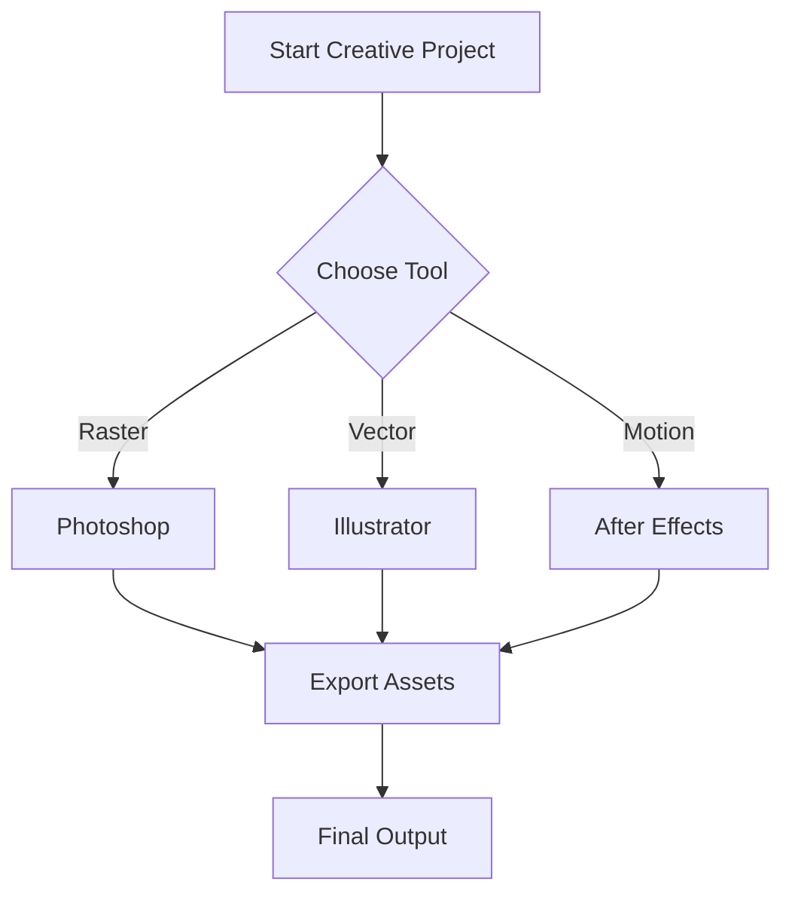

# The Complete Markdown Showcase

> **A comprehensive demonstration of Markdown's capabilities**  
> Created to illustrate every feature from basic to advanced

---

## Table of Contents

1. [Text Formatting](#text-formatting)
2. [Lists and Tasks](#lists-and-tasks)
3. [Code and Syntax](#code-and-syntax)
4. [Tables](#tables)
5. [Links and References](#links-and-references)
6. [Images and Media](#images-and-media)
7. [Blockquotes and Callouts](#blockquotes-and-callouts)
8. [Advanced Features](#advanced-features)

---

## Text Formatting

### Basic Emphasis

This is **bold text** and this is __also bold__.  
This is *italic text* and this is _also italic_.  
This is ***bold and italic*** combined.  
This is ~~strikethrough~~ text.

### Underline and Highlighting

This is <u>underlined text</u> (HTML - works on GitHub/GitLab).  
This is <mark>highlighted text</mark> (HTML - works on GitHub/GitLab).

**Note:** The `==highlight==` syntax is non-standard and only works in specific apps like Obsidian.

### Subscript and Superscript

Water's chemical formula: H<sub>2</sub>O  
Einstein's famous equation: E=mc<sup>2</sup>

### Keyboard Keys

Press <kbd>Ctrl</kbd> + <kbd>C</kbd> to copy.  
Use <kbd>⌘</kbd> + <kbd>S</kbd> to save on Mac.

---

## Lists and Tasks

### Ordered Lists

1. First item
2. Second item
   1. Nested item
   2. Another nested item
3. Third item

### Unordered Lists

- Item one
- Item two
  * Nested with asterisk
  * Another nested
- Item three
  + Nested with plus
    - Deeply nested item

### Task Lists

- [x] Completed task
- [x] Another completed task
- [ ] Incomplete task
- [ ] Another incomplete task
  - [x] Nested completed subtask
  - [ ] Nested incomplete subtask

### Definition Lists

First Term
: This is the definition of the first term.

Second Term
: This is the definition of the second term.
: A term can have multiple definitions.

---

## Code and Syntax

### Inline Code

Use the `console.log()` function to output text. Variables like `userName` follow camelCase convention.

### Code Blocks with Syntax Highlighting

```javascript
// JavaScript example with syntax highlighting
function createParticleSystem(count, options = {}) {
  const particles = [];
  
  for (let i = 0; i < count; i++) {
    particles.push({
      x: Math.random() * options.width,
      y: Math.random() * options.height,
      velocity: { x: Math.random() * 2 - 1, y: Math.random() * 2 - 1 },
      color: options.color || '#ffffff'
    });
  }
  
  return particles;
}
```

```python
# Python example with syntax highlighting
def process_image_batch(images, filters):
    """Apply multiple filters to a batch of images."""
    processed = []
    
    for img in images:
        result = img.copy()
        for filter_func in filters:
            result = filter_func(result)
        processed.append(result)
    
    return processed
```

### Code with Annotations

```jsx
// Key imports for React hooks
import React, { useState, useEffect } from 'react';

// Main component with hover and particle state
function AnimatedButton({ label, onClick }) {
  const [isHovered, setIsHovered] = useState(false);  // Track hover state
  const [particles, setParticles] = useState([]);     // Particle system array

  return <button onMouseEnter={() => setIsHovered(true)}>{label}</button>;
}
```

**Note:** Line highlighting syntax like `{1,3-5}` only works in specific documentation frameworks (Docusaurus, VuePress, Astro) and won't render in standard Markdown viewers like GitHub.

### Diff Syntax

```diff
function updateScore(player) {
-  score = score + 1;
+  score = Math.min(score + 1, maxScore);
+  triggerScoreAnimation(score);
}
```

---

## Tables

### Basic Table

| Feature | Photoshop | Illustrator | After Effects |
|---------|-----------|-------------|---------------|
| Raster Editing | ✓ | ✗ | Limited |
| Vector Graphics | Limited | ✓ | ✓ |
| Animation | Limited | ✗ | ✓ |
| 3D Support | ✓ | ✗ | ✓ |

### Aligned Columns

| Left Aligned | Centre Aligned | Right Aligned |
|:-------------|:--------------:|--------------:|
| Text         | Text           | Text          |
| More text    | More text      | More text     |
| Even more    | Even more      | Even more     |

### Complex Table with Formatting

| Language | Difficulty | Use Case | **Recommended?** |
|----------|:----------:|----------|:----------------:|
| **Python** | ⭐⭐☆☆☆ | Scripting, automation, data processing | ✅ |
| **JavaScript** | ⭐⭐⭐☆☆ | Web dev, game engines, After Effects | ✅ |
| **ExtendScript** | ⭐⭐⭐⭐☆ | Adobe automation (legacy) | ⚠️ |
| **C++** | ⭐⭐⭐⭐⭐ | Game engines, plugins, performance | 🔧 |

---

## Links and References

### Basic Links

Visit [Markdown Guide](https://www.markdownguide.org) for more information.

### Links with Titles

Visit [Markdown Guide](https://www.markdownguide.org "Official Markdown Documentation") for comprehensive docs.

### Reference-Style Links

Check out [GitHub][1], [GitLab][2], and [Bitbucket][3] for version control.

[1]: https://github.com "GitHub Homepage"
[2]: https://gitlab.com "GitLab Homepage"
[3]: https://bitbucket.org "Bitbucket Homepage"

### Automatic Links

<https://example.com>  
<user@example.com>

### Anchor Links

Jump to [Advanced Features](#advanced-features) section.

---

## Images and Media

### Basic Image


### Image with Reference

![Creative Suite Workflow][workflow-diagram]

[workflow-diagram]: https://via.placeholder.com/800x300/6b46c1/ffffff?text=Creative+Workflow "Typical Creative Suite Workflow"

### Image with Link

[](https://example.com)

### Image Size Control (HTML)


---

## Blockquotes and Callouts

### Simple Blockquote

> This is a simple blockquote.  
> It can span multiple lines.

### Nested Blockquotes

> This is the first level.
>
> > This is nested inside.
> >
> > > This is deeply nested.

### Blockquote with Other Elements

> ### Important Note
>
> When scripting for Adobe applications:
>
> - Always include error handling
> - Test on duplicates, never originals
> - **Save frequently** during development
>
> ```javascript
> try {
>   // Your script here
> } catch (error) {
>   alert("Error: " + error.message);
> }
> ```

### Alert Callouts (GitHub Style)

> [!NOTE]
> Useful information that users should know, even when skimming content.

> [!TIP]
> Helpful advice for doing things better or more easily.

> [!IMPORTANT]
> Key information users need to know to achieve their goal.

> [!WARNING]
> Urgent info that needs immediate user attention to avoid problems.

> [!CAUTION]
> Advises about risks or negative outcomes of certain actions.

---

## Advanced Features

### Footnotes

Here's a sentence with a footnote.[^1] And here's another.[^2]

[^1]: This is the first footnote with detailed explanation.
[^2]: This is the second footnote with additional context.

### Automatic URL Linking

Check out https://example.com and www.example.com.

### Emoji Support

:rocket: :art: :zap: :fire: :tada:  
🎮 🎨 💻 ⚡ 🚀

### Escape Characters

Use \* asterisks \* without \*\*formatting\*\*.  
Backslash: \\, backtick: \`, underscore: \_.

### Horizontal Rules

Three or more of the following:

---

***

___

### HTML in Markdown

Markdown supports many HTML elements for enhanced functionality:

#### Collapsible Sections

<details>
<summary>Click to expand: Basic collapsible section</summary>

This content is hidden by default and revealed when clicked.

You can include **Markdown formatting** inside!

- Lists work
- Multiple items
- All standard Markdown

</details>

<details>
<summary>Click to expand: Code example</summary>

```javascript
// Adobe ExtendScript example
#target photoshop

function batchProcessLayers() {
  var doc = app.activeDocument;
  var layers = doc.layers;
  
  for (var i = 0; i < layers.length; i++) {
    if (layers[i].kind === LayerKind.TEXT) {
      layers[i].textItem.size = 24;
    }
  }
}

batchProcessLayers();
```

</details>

<details>
<summary>Click to expand: Nested collapsible sections</summary>

You can nest collapsible sections:

<details>
<summary>Inner section 1</summary>

Content for inner section 1

</details>

<details>
<summary>Inner section 2</summary>

Content for inner section 2

</details>

</details>

#### Text Alignment

<div align="center">

**Centre-aligned content**

This entire block is centred

</div>

<div align="right">

Right-aligned content goes here

</div>

#### Custom Styling with Inline CSS

<p style="color: #e91e63; font-weight: bold;">Coloured and bold text using inline styles</p>

<div style="background-color: #f0f0f0; padding: 10px; border-left: 4px solid #2196F3;">
Custom styled callout box using inline CSS
</div>

#### Image Control


<picture>
  <source media="(prefers-color-scheme: dark)" srcset="https://via.placeholder.com/400x100/333/fff?text=Dark+Mode">
  <source media="(prefers-color-scheme: light)" srcset="https://via.placeholder.com/400x100/fff/333?text=Light+Mode">
  
</picture>

#### Special Characters and Symbols

<sub>Subscript text</sub> and <sup>Superscript text</sup>

<kbd>Ctrl</kbd> + <kbd>C</kbd> for keyboard keys

<mark>Highlighted text</mark> with the mark element

<u>Underlined text</u> using the u element

#### Definition Lists

<dl>
  <dt>Term 1</dt>
  <dd>Definition of term 1</dd>
  
  <dt>Term 2</dt>
  <dd>Definition of term 2</dd>
  <dd>Second definition for term 2</dd>
</dl>

#### Tables with HTML

<table>
  <thead>
    <tr>
      <th>Feature</th>
      <th align="center">Status</th>
      <th align="right">Priority</th>
    </tr>
  </thead>
  <tbody>
    <tr>
      <td>Batch Processing</td>
      <td align="center">✅ Complete</td>
      <td align="right">High</td>
    </tr>
    <tr>
      <td>Error Handling</td>
      <td align="center">🚧 In Progress</td>
      <td align="right">Medium</td>
    </tr>
    <tr>
      <td colspan="3" align="center"><strong>Merged cell across all columns</strong></td>
    </tr>
  </tbody>
</table>

#### Comments (Invisible)

<!-- This is an HTML comment that won't be visible in the rendered output -->
<!-- Useful for leaving notes to yourself or other developers -->

#### Line Breaks and Spacing

Use `<br>` for explicit line breaks:<br>
This text appears on a new line<br>
And this on another line

Use `&nbsp;` for non-breaking spaces: Word1&nbsp;&nbsp;&nbsp;&nbsp;Word2

#### Blockquote Styling

<blockquote>
  <p>Custom blockquote using HTML tags</p>
  <footer>— <cite>Author Name</cite></footer>
</blockquote>

### Mathematical Expressions (with extensions)

Inline maths: $E = mc^2$

Block maths:

$$
\frac{-b \pm \sqrt{b^2 - 4ac}}{2a}
$$

### Mermaid Diagrams (when supported)



### Comments (Not Rendered)

[//]: # (This is a comment that won't be displayed)
[//]: # (Useful for leaving notes in your markdown files)

---

## Combining Everything

Here's a complex example combining multiple features:

### 🎮 Game Development Pipeline

> [!TIP]
> This workflow is optimised for indie developers using Adobe Creative Suite alongside game engines.

| Stage | Tool | Output | Script Available? |
|-------|------|--------|:-----------------:|
| **Concept Art** | Photoshop | `.psd`, `.png` | ✅ |
| **UI Design** | Illustrator | `.ai`, `.svg` | ✅ |
| **Animation** | After Effects | `.mp4`, `.mov` | ✅ |
| **Implementation** | Unity/Unreal | Game build | 🔧 |

#### Automation Script Example

```javascript
// Batch export for game assets
function exportGameAssets() {
  const sizes = [32, 64, 128, 256, 512];
  const formats = ['png', 'webp'];
  
  sizes.forEach(size => {
    formats.forEach(format => {
      // Export logic here
      console.log(`Exporting ${size}x${size}.${format}`);
    });
  });
}
```

**Key Considerations:**[^3]

- [ ] Maintain consistent naming conventions
- [ ] Use non-destructive editing
- [x] Set up colour profiles correctly
- [ ] Automate repetitive tasks with scripts

[^3]: These practices will save hours during production.

---

<div align="center">

**Made with ❤️ using Markdown**

*Demonstrating every feature from basic to advanced*

[](https://opensource.org/licenses/MIT)

</div>

---

## Accessibility Features

### Semantic HTML Elements

<article>
<h4>Using Semantic Tags</h4>
<p>Proper semantic HTML improves accessibility and SEO.</p>
</article>

### Abbreviations

The <abbr title="Adobe Creative Cloud">ACC</abbr> subscription includes all major creative tools.

### Mark Text

This is <mark>highlighted for emphasis</mark> using the mark tag.

---

*This document was last updated: **October 2025***